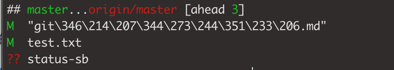

[TOC]

[转载连接地址](https://blog.csdn.net/web_csdn_share/article/details/79243308)

## 一、git 仓库描述


译名如下：

> * Workspace: 工作区
> * index/Stage： 暂存区
> * Repository: 仓库区（或本地仓库）
> * Remote: 远程仓库
> 
> 本地分支关联远程： git branch --set-upstream-to=origin/beta beta

## 二、新建代码库

* `git init` 在当前目录下新建一个git代码库
* `git init [project-name]` 新建一个目录，将其初始为git代码库
* `git clone [url]` 下载一个项目和他的整个代码历史

## 三、配置

git的设置文件为 `.gitconfig`，它可以在用户主目录下（**全局配置**），也可以在项目目录下（**项目配置**）

* `git config --list`  显示当前的git配置
* `git config --edit [--global]`  编辑git配置文件
* `git config [--global] user.name "[name]"` 设置提交代码时的用户名
* `git config [--global] user.email "[email address]"` 设置提交代码时的用户邮箱

## 四、增加删除文件

* `git add [file1] [file2] ...` 添加指定文件到暂存区
* `git add [dir]` 添加指定目录到暂存区，包括子目录
* `git add .` 添加当前目录的所有文件到暂存区
* `git add -p` 添加每一个变化前，都会要求确认，对应同一个文件的多处变化，可以实现分次提交
* `git rm [file1] [file2] ...` 删除工作区的文件，并且将这次删除放入暂存区
* `git rm --cached [file]` 停止追踪指定文件，但该文件会保留在工作区
* `git mv [file-original] [file-renamed]` 改名文件，并且将这个改名放入暂存区

## 五、代码提交

* `git commit -m [message]` 提交暂存区到仓库区
* `git commit [file1] [file2] ... -m [message]` 提交暂存区的指定文件到仓库区
* `git commit -a`  提交工作区自上次commit之后的变化，直接到仓库区
* `git commit -v` 提交时显示所有的diff信息
* `git commit --amend -m [message]` 使用一次新的commit，替代上一次提交，如果代码没有任何变化，则用来改下上一次commit的提交信息
* `git commit --amend [file1] [file2] ...` 重做上一次commit，并包括制定文件的新变化

## 六、分支

* `git branch`  列出所有本地分支
* `git branch -r` 列出所有的远程分支
* `git branch -a` 列出所有本地分支和远程分支
* `git branch [branch-name]` 新建一个分支，但依然停留在当前分支
* `git checkout -b [branch] origin/[remote-branch]` 以远程分支为基础新建一个分支，并切换到该分支
* `git branch [branch] [commit]` 新建一个分支，指向指定的commit  
* `git branch --track [branch] [remote-branch]` 新建 一个分支，与指定的远程分支建立追踪关系
* `git checkout [branch-name]` 切换到指定分支，并更新工作区
* `git checkout -` 切换到上一个分支
* `git branch --set-upstream [branch] [remote-branch]` 建立追踪关系，在现有分支与指定的远程分支之间
* `git merge [branch]` 合并指定分支到当前分支
* `git cherry-pick [commit]` 选择一个commit，合并进当前的分支
* `git branch -d [branch-name]` 删除分支
* `git push origin --delete [branch-name]` 删除远程分支
* `git branch -dr [remote/branch]` 删除远程分支
* `git rev-parse --abbrev-ref HEAD` 获取当前分支名称

## 七、标签

* `git tag` 列出所有的tag
* `git tag [tag]` 新建一个tag在当前的commit
* `git tag [tag] [commit]` 新建一个tag在指定commit
* `git tag -d [tag]` 删除本地tag
* `git push origin :refs/tags/[tagName]` 删除远程tag
* `git show [tag]` 查看tag信息
* `git push [remote] [tag]` 提交指定tag
* `git push [remote] --tags` 提交所有tag
* `git checkout -b [branch] [tag]`  新建一个分支，指向某个tag

## 八、查看信息

* `git status` 显示有变更的文件

* `git status -sb` 显示有变更的文件，和当前的分支状态
  
    执行git status -sb指令如下图
  
    
  
  > `??` 表示未跟踪文件
  > `M` 表示跟踪有变动文件

* `git log` 显示当前分支的版本历史

* `git log --stat` 显示commit历史，以及每次commit发生变更的文件

* `git log -S [keyword]` 搜索提交历史，根据关键词

* `git log [tag] HEAD --pretty=format:%s` 显示某个commit之后的所有变动，每个commit占据一行

* `git log [tag] HEAD --grep feature` 显示某个commit之后的所有变动，其"提交说明"必须符合搜索条件

* `git log --follow [file]` 显示某个文件的版本历史，包括文件改名

* `git whatchanged [file]` 显示某个文件的版本历史，包括文件改名

* `git log -p [file]` 显示指定文件相关的每一次diff

* `git log -5 --pretty --oneline` 显示过去5次提交

* `git shortlog -sn` 显示所有提交过的用户，按提交次数排序

* `git blame [file]` 显示指定文件是什么人在什么时间修改过

* `git diff` 显示暂存区和工作区的差异

* `git diff --cached [file]` 显示暂存区和上一个commit的差异

* `git diff HEAD` 显示工作区与当前分支最新commit之间的差异

* `git diff [first-branch]...[second-branch]` 显示两次提交之间的差异

* `git diff --shortstat "@{0 day ago}"` 显示今天你写了多少行代码

* `git show [commit]` 显示某次提交的元数据和内容变化

* `git show --name-only [commit]` 显示某次提交发生变化的文件

* `git show [commit]:[filename]` 显示某次提交时，某个文件的内容

* `git reflog` 显示当前分支的最近几次提交

## 九、远程同步

* `git fetch [remote]` 下载远程仓库的所有变动
* `git remote -v` 显示所有远程仓库
* `git remote show [remote]` 显示某个远程仓库的信息
* `git remote add [shortname] [url]` 增加一个新的远程仓库，并命名
* `git pull [remote] [branch]` 取回远程仓库的变化，并与本地分支合并
* `git push [remote] [branch]` 上传本地指定分支到远程仓库
* `git push [remote] --force` 强行推送当前分支到远程仓库，即使有冲突
* `git push [remote] --all` 推送所有分支到远程仓库
* `git remote update origin --prune` 远程仓库删除了，本地跟着同步一下

## 十、撤销

* `git checkout [file] ` 恢复暂存区的指定文件到工作区
* `git checkout [commit] [file] ` 恢复某个commit的指定文件到暂存区和工作区
* `git checkout . ` 恢复暂存区的所有文件到工作区
* `git reset [file]` 重置暂存区的指定文件，与上一次commit保持一致，但工作区不变
* `git reset --hard ` 重置暂存区与工作区，与上一次commit保持一致
* `git reset [commit] ` 重置当前分支的指针为指定commit，同时重置暂存区，但工作区不变
* `git reset --hard [commit] ` 重置当前分支的HEAD为指定commit，同时重置暂存区和工作区，与指定commit一致
* `git reset --keep [commit] ` 重置当前HEAD为指定commit，但保持暂存区和工作区不变
* `git revert [commit] ` 新建一个commit，用来撤销指定commit,  后者的所有变化都将被前者抵消，并且应用到当前分支
* `git stash ` 暂时将未提交的变化移除，稍后再移入
* `git stash pop ` 暂时将未提交的变化移除，稍后再移入

## 十一、其他

* `git archive` 生成一个可供发布的压缩包

* 忽略已跟踪的文件
  
  ```
  精确忽略已跟踪的文件 
         git update-index --assume-unchaged [file]   
  忽略当前目录下的已跟踪文件
      git ls-files -z | xargs -0 git update-index --assume-unchanged  
    恢复当前目录下忽略的已跟踪文件
       git ls-files -z | xargs -0 git update-index --no-assume-unchanged   
  ```
  
    [参考连接1](https://stackoverflow.com/questions/12288212/git-update-index-assume-unchanged-on-directory)
    [参考连接2](https://blog.csdn.net/yingleiming/article/details/105691201)
  
  ## 十二、问题

### 1. `early EOF`问题

 git clone 大文件时，中间半途退出问题

> 

     client_loop: send disconnect: Broken pipeMiB | 81.00 KiB/s  
    fetch-pack: unexpected disconnect while reading sideband packet
    fatal: early EOF
    fatal: index-pack failed

解决方案：

* 只克隆一层  ，指令为 `git clone --depth 1  url`
    [depth描述链接](https://blog.csdn.net/qq_43827595/article/details/104833980) 
    [其他指令链接](https://www.wangt.cc/2021/03/git%E5%85%8B%E9%9A%86%E5%A4%A7%E4%BB%93%E5%BA%93%E6%8A%A5%E9%94%99%E8%A7%A3%E5%86%B3%E5%8A%9E%E6%B3%95/)
  
  * `git fetch --unshallow`
  * `git fetch --depth=2147483647`
  * `git pull --all` 

* 如果不管用，可以借用码云中转。
  
  * 登录 gitee账号，右上角 `+` -> `从github/gitLab导入仓库`
  * 输入对应的url，点击导入
  * 等待一会，会在账号下建立一个同内容的仓库，终端执行指令，clone这个仓库
  * 完成后，进入.git文件，修改config文件里的 url 为开始要clone的url

* 修改git的配置
  
  * `git config --global http.postBuffer 524288000`
  * `export GIT_TRACE_PACKET=1`
  * `export GIT_TRACE=1`
  * `export GIT_CURL_VERBOSE=1 `
  
  $ git remote set-branches origin 'baseline_prd'
